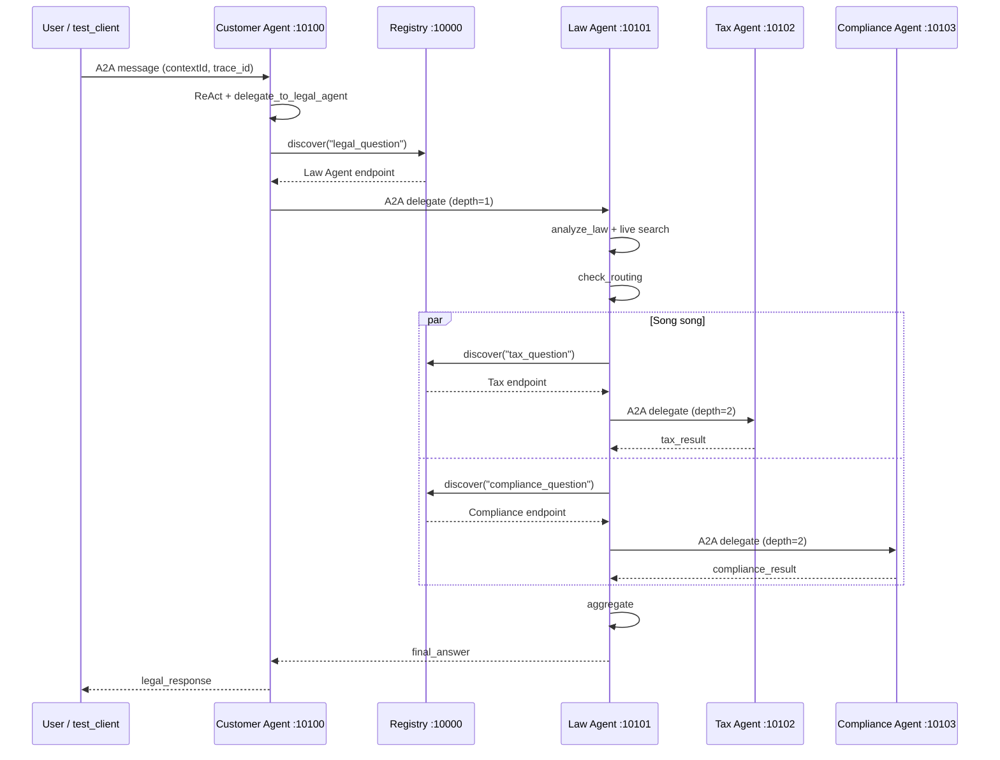

# Codelab: Xây Dựng Hệ Thống Multi-Agent với A2A Protocol

**Thời gian:** 2 giờ  
**Ngôn ngữ:** Python 3.11+  
**Công nghệ:** LangGraph, LangChain, A2A SDK

## Mục Tiêu Học Tập

Sau khi hoàn thành codelab này, bạn sẽ:

- Hiểu cách LLM hoạt động từ cơ bản đến nâng cao
- Biết cách tích hợp tools và RAG vào LLM
- Xây dựng được single agent với ReAct pattern
- Tạo multi-agent system với LangGraph
- Triển khai distributed agents với A2A protocol

## Chuẩn Bị

### Yêu Cầu Hệ Thống

- Python 3.11 trở lên
- [uv](https://docs.astral.sh/uv/) package manager
- API key từ [OpenRouter](https://openrouter.ai)

### Cài Đặt

```bash
# Clone repository
git clone <repo-url>
cd legal_multiagent

# Cài đặt dependencies
uv sync

# Cấu hình environment
cp .env.example .env
# Sửa file .env, thêm OPENROUTER_API_KEY của bạn
```

---

## Phần 1: Direct LLM Calling (20 phút)

### Lý Thuyết

LLM (Large Language Model) ở dạng cơ bản nhất là một API nhận input text và trả về output text. Không có memory, không có tools, chỉ dựa vào training data.

**Ưu điểm:**

- Đơn giản, dễ implement
- Phản hồi nhanh

**Nhược điểm:**

- Không có kiến thức real-time
- Không thể tra cứu database
- Không có context giữa các lần gọi

### Thực Hành

**Bước 1:** Chạy demo Stage 1

```bash
uv run python stages/stage_1_direct_llm/main.py
```

**Bước 2:** Đọc và hiểu code

Mở file `stages/stage_1_direct_llm/main.py` và trả lời:

1. LLM được khởi tạo như thế nào? (Tìm hàm `get_llm()`)   
Gọi `get_llm()` trong `common/llm.py`. Hàm này tạo `ChatOpenAI` (LangChain) trỏ tới provider theo `.env`:
  - Có `MISTRAL_API_KEY` → Mistral API (`https://api.mistral.ai/v1`)
  - Có `OPENROUTER_API_KEY` → OpenRouter
  - Còn lại → OpenAI
  Tham số chung: `max_tokens=1024`, `temperature=0.3`.
2. Message được gửi đến LLM có cấu trúc gì?  
Danh sách message theo thứ tự:
  messages = [
      SystemMessage(content="..."),   *# vai trò + hướng dẫn*
      HumanMessage(content=QUESTION), *# câu hỏi người dùng*
  ]
  Gọi bất đồng bộ: `response = await llm.ainvoke(messages)`.
3. Tại sao cần có `SystemMessage` và `HumanMessage`?

  | **Loại**        | **Vai trò**                                                                |
  | --------------- | -------------------------------------------------------------------------- |
  | `SystemMessage` | Định nghĩa persona (chuyên gia pháp lý), giới hạn độ dài, ngôn ngữ trả lời |
  | `HumanMessage`  | Nội dung câu hỏi thực tế của người dùng                                    |

  Tách instruction và input giúp model ổn định hơn và dễ tái sử dụng prompt.

**Bài Tập 1.1:** Thay đổi câu hỏi

Sửa biến `QUESTION` thành câu hỏi pháp lý khác (tiếng Việt hoặc tiếng Anh) và chạy lại.  
**1.1:** Đổi `QUESTION` (repo đã dùng câu tiếng Việt về NDA) rồi chạy `uv run python stages/stage_1_direct_llm/main.py`.

**Bài Tập 1.2:** Thêm temperature control

Thêm parameter `temperature=0.3` vào hàm `get_llm()` trong `common/llm.py` để làm output ổn định hơn.  
**1.2:** `temperature=0.3` đã có trong `get_llm()` — output ổn định, ít “sáng tạo” hơn.

---

## Phần 2: LLM + RAG & Tools (30 phút)

### Lý Thuyết

**RAG (Retrieval-Augmented Generation):** Cho phép LLM tra cứu knowledge base trước khi trả lời.

**Tools:** Các function mà LLM có thể gọi để thực hiện tác vụ cụ thể (tính toán, query database, gọi API).

**Function Calling Flow:**

1. LLM nhận câu hỏi + danh sách tools
2. LLM quyết định gọi tool nào (hoặc không gọi)
3. Tool được execute, trả về kết quả
4. LLM nhận kết quả và tạo câu trả lời cuối cùng

### Thực Hành

**Bước 1:** Chạy demo Stage 2

```bash
uv run python stages/stage_2_rag_tools/main.py
```

**Bước 2:** Phân tích code

Mở `stages/stage_2_rag_tools/main.py` và tìm:

1. Hàm `@tool` decorator được dùng ở đâu?  
Trên `search_legal_database` và `calculate_damages` (khoảng dòng 96–138 trong `stage_2_rag_tools/main.py`).
2. `LEGAL_KNOWLEDGE` được cấu trúc như thế nào?  
Mỗi entry là dict:
  {
  "id": "ucc_breach",           *# mã định danh*
  "keywords": ["breach", ...], *# từ khóa tra cứu*
  "text": "..."                 *# nội dung pháp lý*
  }
  Stage 2 hiện dùng **ChromaDB semantic search** từ Day 8 (`semantic_search`) thay vì keyword match thuần.
3. LLM được bind với tools ra sao? (Tìm `.bind_tools()`)  
llm_with_tools = llm.bind_tools(TOOLS)
  response = await llm_with_tools.ainvoke(messages)
  Nếu có `tool_calls`, execute tool → append `ToolMessage` → gọi LLM lần 2 để tổng hợp.

**Bài Tập 2.1:** Thêm knowledge base entry

Thêm một entry mới vào `LEGAL_KNOWLEDGE` về luật lao động:

```python
{
    "id": "labor_law",
    "keywords": ["lao động", "sa thải", "hợp đồng lao động", "labor", "termination"],
    "text": (
        "Theo Bộ luật Lao động Việt Nam 2019, người sử dụng lao động có thể "
        "đơn phương chấm dứt hợp đồng trong các trường hợp: (1) người lao động "
        "thường xuyên không hoàn thành công việc; (2) bị ốm đau, tai nạn đã điều trị "
        "12 tháng chưa khỏi; (3) thiên tai, hỏa hoạn; (4) người lao động đủ tuổi nghỉ hưu."
    ),
}
```

**Bài Tập 2.2:** Tạo tool mới

Tạo một tool `@tool` mới tên `check_statute_of_limitations` nhận vào `case_type` (string) và trả về thời hiệu khởi kiện:

```python
@tool
def check_statute_of_limitations(case_type: str) -> str:
    """Kiểm tra thời hiệu khởi kiện theo loại vụ án.
    
    Args:
        case_type: Loại vụ án (contract, tort, property)
    """
    limits = {
        "contract": "4 năm (UCC § 2-725)",
        "tort": "2-3 năm tùy bang",
        "property": "5 năm",
    }
    return limits.get(case_type.lower(), "Không xác định")
```

Thêm tool này vào danh sách tools và test.

---

## Phần 3: Single Agent với ReAct (25 phút)

### Lý Thuyết

**ReAct Pattern:** Reasoning + Acting

Agent tự động lặp lại chu trình:

1. **Think:** Suy nghĩ cần làm gì
2. **Act:** Gọi tool
3. **Observe:** Nhận kết quả
4. Lặp lại cho đến khi có câu trả lời cuối cùng

LangGraph cung cấp `create_react_agent` để tự động hóa pattern này.

### Thực Hành

**Bước 1:** Chạy demo Stage 3

```bash
uv run python stages/stage_3_single_agent/main.py
```

**Bước 2:** Quan sát output

Chú ý cách agent tự động:

- Quyết định tool nào cần gọi
- Gọi nhiều tools liên tiếp
- Tổng hợp kết quả

**Bước 3:** Đọc code

Mở `stages/stage_3_single_agent/main.py`:

1. Tìm `create_react_agent()` — đây là magic function
2. So sánh với Stage 2: không còn manual tool loop
3. Xem `agent_executor.invoke()` — chỉ cần gọi một lần

**Bài Tập 3.1:** Thêm tool tra cứu án lệ

```python
@tool
def search_case_law(keywords: str) -> str:
    """Tìm kiếm án lệ theo từ khóa.
    
    Args:
        keywords: Từ khóa tìm kiếm
    """
    cases = {
        "breach": "Hadley v. Baxendale (1854) - Consequential damages",
        "negligence": "Donoghue v. Stevenson (1932) - Duty of care",
        "contract": "Carlill v. Carbolic Smoke Ball Co (1893) - Unilateral contract",
    }
    for key, case in cases.items():
        if key in keywords.lower():
            return case
    return "Không tìm thấy án lệ phù hợp"
```

Thêm vào tools list và test với câu hỏi về breach of contract.

**Bài Tập 3.2:** Debug agent reasoning

Thêm `verbose=True` vào `create_react_agent()` để xem chi tiết quá trình suy nghĩ của agent.

---

## Phần 4: Multi-Agent In-Process (30 phút)

### Lý Thuyết

**Multi-Agent System:** Nhiều agents chuyên môn hóa cùng làm việc.

**Ưu điểm:**

- Mỗi agent tập trung vào domain riêng
- Có thể chạy song song (parallel execution)
- Dễ maintain và mở rộng

**LangGraph StateGraph:**

- Định nghĩa state (dữ liệu chia sẻ giữa các nodes)
- Tạo nodes (các bước xử lý)
- Định nghĩa edges (luồng điều khiển)

**Send API:** Cho phép dispatch nhiều tasks song song.

### Thực Hành

**Bước 1:** Chạy demo Stage 4

```bash
uv run python stages/stage_4_milti_agent/main.py
```

**Bước 2:** Phân tích kiến trúc

Mở `stages/stage_4_milti_agent/main.py`:

1. Tìm `class State(TypedDict)` — đây là shared state
2. Tìm các agent functions: `law_agent`, `tax_agent`, `compliance_agent`
3. Tìm `Send()` API — dispatch parallel tasks
4. Xem `graph.add_node()` và `graph.add_edge()`

**Bước 3:** Vẽ graph

```python
# Thêm vào cuối file main.py
from IPython.display import Image, display
display(Image(graph.get_graph().draw_mermaid_png()))
```

**Bài Tập 4.1:** Thêm agent mới

Tạo `privacy_agent` chuyên về GDPR và privacy law:

```python
def privacy_agent(state: State) -> dict:
    """Agent chuyên về luật bảo vệ dữ liệu cá nhân."""
    llm = get_llm()
    
    prompt = f"""Bạn là chuyên gia về GDPR và luật bảo vệ dữ liệu cá nhân.
    
Câu hỏi gốc: {state['question']}
Phân tích pháp lý: {state.get('law_analysis', 'N/A')}

Hãy phân tích các vấn đề về privacy và GDPR (nếu có).
"""
    
    response = llm.invoke([HumanMessage(content=prompt)])
    return {"privacy_analysis": response.content}
```

Thêm node này vào graph và kết nối với `aggregate_results`.

**Bài Tập 4.2:** Implement conditional routing

Sửa `check_routing` để chỉ gọi privacy_agent khi câu hỏi có từ khóa "data", "privacy", "gdpr":

```python
def check_routing(state: State) -> list[Send]:
    question_lower = state["question"].lower()
    tasks = []
    
    if any(kw in question_lower for kw in ["tax", "irs", "thuế"]):
        tasks.append(Send("tax_agent", state))
    
    if any(kw in question_lower for kw in ["compliance", "sec", "regulation"]):
        tasks.append(Send("compliance_agent", state))
    
    if any(kw in question_lower for kw in ["data", "privacy", "gdpr", "dữ liệu"]):
        tasks.append(Send("privacy_agent", state))
    
    return tasks if tasks else [Send("aggregate_results", state)]
```

---

## Phần 5: Distributed A2A System (15 phút)

### Lý Thuyết

**A2A (Agent-to-Agent) Protocol:** Chuẩn giao tiếp giữa các agents qua HTTP.

**Khác biệt với Stage 4:**

- Mỗi agent là một service độc lập
- Giao tiếp qua HTTP thay vì in-process
- Dynamic discovery qua Registry
- Có thể scale từng agent riêng biệt

**Kiến trúc:**

```
Registry (10000) ← agents register on startup
    ↓
Customer Agent (10100) → Law Agent (10101)
                              ↓
                    ┌─────────┴─────────┐
                    ↓                   ↓
            Tax Agent (10102)   Compliance Agent (10103)
```

### Thực Hành

**Bước 1:** Khởi động toàn bộ hệ thống

```bash
# Linux/macOS
./start_all.sh

# Windows
uv run python start_all.py
```

Chờ ~10 giây để tất cả services khởi động.

**Bước 2:** Test hệ thống

```bash
uv run python test_client.py
```

**Bước 3:** Quan sát logs

Mở 5 terminal tabs và xem logs của từng service:

- Registry: port 10000
- Customer Agent: port 10100
- Law Agent: port 10101
- Tax Agent: port 10102
- Compliance Agent: port 10103

**Bài Tập 5.1:** Trace request flow

Trong logs, tìm `trace_id` và theo dõi request đi qua các agents. Vẽ sequence diagram.

**Đáp án 5.1:** Luồng request đi qua các agents (theo `trace_id` trong log):



Cách theo dõi trong log:

1. Tìm `trace_id` khi Customer Agent nhận request
2. Theo dõi cùng `trace_id` qua Law Agent → Tax/Compliance (song song)
3. `context_id` dùng cho conversation memory (lịch sử hội thoại)
4. `delegation_depth` tăng mỗi lần ủy quyền sang agent khác

**Bài Tập 5.2:** Test dynamic discovery

1. Dừng Tax Agent (Ctrl+C)
2. Chạy lại `test_client.py`
3. Quan sát lỗi và cách hệ thống xử lý

**Đáp án 5.2:**

- Law Agent vẫn chạy bình thường, gọi Registry để discover Tax Agent
- Registry không trả về endpoint Tax (agent đã dừng) → `call_tax` bắt exception
- Hệ thống **graceful degradation**: trả về `[Tax analysis unavailable: ...]` thay vì crash toàn bộ
- Compliance Agent vẫn chạy song song và trả kết quả bình thường
- Customer Agent vẫn nhận được câu trả lời tổng hợp (thiếu phần thuế)

**Bài Tập 5.3:** Modify agent behavior

Sửa `tax_agent/graph.py`, thay đổi system prompt để agent trả lời ngắn gọn hơn. Restart tax agent và test lại.

**Đáp án 5.3:** Thêm vào system prompt trong `tax_agent/graph.py`:

```python
"Giữ câu trả lời dưới 150 từ, dùng bullet points."
```

Sau đó restart chỉ Tax Agent (hoặc chạy lại `start_all.py`) và test bằng `test_client.py`. Kết quả: phần phân tích thuế ngắn hơn, giảm latency cho nhánh Tax.

---

## Phần 6: Tổng Kết & Mở Rộng (10 phút)

### So Sánh 5 Stages


| Stage | Pattern         | Use Case                             | Complexity |
| ----- | --------------- | ------------------------------------ | ---------- |
| 1     | Direct LLM      | Câu hỏi đơn giản, không cần tools    | ⭐          |
| 2     | LLM + Tools     | Cần tra cứu data hoặc tính toán      | ⭐⭐         |
| 3     | ReAct Agent     | Tự động orchestration, multi-step    | ⭐⭐⭐        |
| 4     | Multi-Agent     | Nhiều domains, parallel processing   | ⭐⭐⭐⭐       |
| 5     | Distributed A2A | Production, scalable, fault-tolerant | ⭐⭐⭐⭐⭐      |


### Câu Hỏi Ôn Tập

1. Khi nào nên dùng single agent thay vì multi-agent?

**Đáp án 1:** Dùng **single agent** (Stage 3) khi:

- Chỉ một domain, logic đơn giản (FAQ, chatbot nội bộ)
- Không cần chuyên môn hóa sâu hay chạy song song
- Team nhỏ, cần triển khai nhanh, chi phí thấp
- Ví dụ: câu hỏi pháp lý đơn giản có tools — Stage 3 đủ dùng

Dùng **multi-agent** khi cần nhiều chuyên gia (luật, thuế, compliance), xử lý song song, hoặc scale từng agent độc lập.

2. Ưu điểm của A2A protocol so với gRPC hoặc REST thông thường?

**Đáp án 2:**

| A2A | REST/gRPC thường |
| --- | ---------------- |
| Chuẩn hóa Agent Card, Message, Task, Parts | Tự định nghĩa schema |
| Agents khác framework vẫn giao tiếp được | Tight coupling |
| Metadata: `trace_id`, `context_id`, `delegation_depth` | Phải tự thiết kế |
| Hỗ trợ discovery qua Registry | URL thường hardcode |

3. Làm thế nào để prevent infinite delegation loops trong A2A?

**Đáp án 3:** Trong `law_agent/graph.py`:

```python
MAX_DELEGATION_DEPTH = 3
```

Mỗi lần ủy quyền sang agent khác, metadata `delegation_depth` tăng 1. Khi `depth >= MAX_DELEGATION_DEPTH`, bỏ qua sub-agents — tránh vòng lặp Customer → Law → Tax → Law → ...

4. Tại sao cần Registry service? Có thể hardcode URLs không?

**Đáp án 4:**

- **Registry:** Agents tự đăng ký khi start → client gọi `discover(task)` thay vì biết trước URL
- Scale độc lập (thêm Tax Agent instance mới không cần sửa code)
- Dev/staging/prod khác endpoint mà không đổi code client

**Hardcode URL** được cho demo nhỏ, nhưng production nên dùng Registry hoặc service mesh.

### Bài Tập Nâng Cao (Tự Học)

**Challenge 1:** Thêm memory/conversation history

Implement conversation memory để agent nhớ các câu hỏi trước đó.

**Gợi ý / Trạng thái trong repo:** Đã có — `customer_agent/memory.py` dùng LangGraph `MemorySaver`, `thread_id = context_id` từ A2A. Frontend lưu lịch sử chat qua `localStorage` (`frontend/src/utils/chatStorage.js`).

**Challenge 2:** Add authentication

Thêm API key authentication cho các A2A endpoints.

**Gợi ý:** Thêm middleware FastAPI kiểm tra header `X-API-Key` trước khi xử lý A2A request. Chưa implement trong repo.

**Challenge 3:** Implement retry logic

Khi một agent fail, tự động retry với exponential backoff.

**Gợi ý:** Trong `common/a2a_client.py` hàm `delegate()` — bọc HTTP call với `tenacity` hoặc vòng lặp retry: `wait = 2**attempt` giây, tối đa 3 lần. Một phần xử lý lỗi đã có (graceful degradation khi agent down).

**Challenge 4:** Monitoring & Observability

Tích hợp LangSmith hoặc Prometheus để monitor agent performance.

**Gợi ý:** Bật LangSmith qua `LANGCHAIN_TRACING_V2=true` + `LANGCHAIN_API_KEY`, hoặc export metrics (latency, error rate) từ logs `trace_id`. Chưa tích hợp trong repo.

---

## Tài Liệu Tham Khảo

- [LangGraph Documentation](https://langchain-ai.github.io/langgraph/)
- [A2A Protocol Spec](https://github.com/google/A2A)
- [OpenRouter API](https://openrouter.ai/docs)
- Architecture diagrams: `docs/*.svg`

## Hỗ Trợ

Nếu gặp vấn đề:

1. Check `.env` file có đúng API key không
2. Đảm bảo tất cả ports (10000-10103) không bị chiếm
3. Xem logs trong terminal để debug
4. Đọc error messages cẩn thận — thường có hint rõ ràng

---

## **Bài Tập Cộng Điểm:**

Sau khi chạy full Stage 5 (test_client.py) trả lời 2 câu hỏi:

- Latency (Tổng thời gian trả lời 1 câu hỏi của hệ thống) là bao nhiêu giây?
- Đề xuất phương án giảm latency và demo + show thời gian xử lý đã giảm được khi apply phương án?

**Đáp án Bài Tập Cộng Điểm:**

**1. Latency hiện tại (ước lượng thực tế):**

| Giai đoạn | Thời gian |
| --------- | --------- |
| Stage 1 (1 LLM call) | ~15–25 giây |
| Stage 5 full A2A (4–6+ LLM calls + live search) | ~45–120 giây |

Frontend chat hiển thị latency ở header sau mỗi câu trả lời.

**Công thức:** Customer → Law (analyze + routing + search) → Tax ∥ Compliance → aggregate → Customer tổng hợp.

Đo lại bằng `test_client.py`:

```python
import time
start = time.time()
# ... gọi API ...
print(f"Latency: {time.time() - start:.2f}s")
```

**2. Phương án giảm latency:**

| Giải pháp | Cơ chế | Giảm ước tính |
| --------- | ------ | ------------- |
| Model nhanh hơn | `gpt-4o-mini` / `mistral-small` | 30–50% |
| Giảm `max_tokens` | 1024 → 512 trong `get_llm()` | 10–20% |
| Tắt live search khi không cần | `ENABLE_LIVE_SEARCH=false` trong `.env` | 5–15s/request |
| Cache routing JSON | Không gọi LLM routing cho cùng pattern câu hỏi | ~3–5s |
| Parallel đã có | Tax + Compliance chạy song song | Đã tối ưu |
| Prompt ngắn hơn (Bài 5.3) | Giới hạn độ dài output specialist | 5–10s |

**Demo:** Chạy `test_client.py` trước và sau khi đổi model hoặc tắt `ENABLE_LIVE_SEARCH`, so sánh thời gian in ra.

**Chúc các bạn học tốt! 🚀**